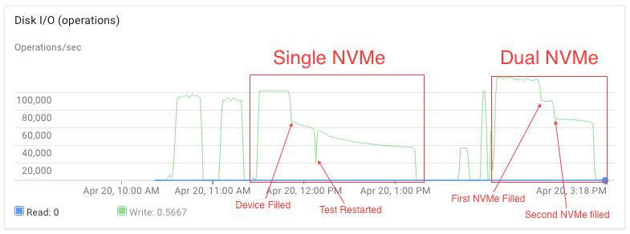

# gce-deployment-manager

Google Deployment Manager scripts and templates for deploying Aerospike CE on Google Compute Engine (GCE)

Download a copy of this repo using either the Download link or use `git clone`.

# Usage

Create a project in Google Compute Engine

Enable Deployment Manager API for your project: https://console.cloud.google.com/flows/enableapi?apiid=deploymentmanager
or from API Manager and enable `Google Cloud Deployment Manager API` and `Google Cloud Deployment Manager V2 API`

Download and install `gcloud` from https://cloud.google.com/sdk/

Configure `gcloud` for your GCE project

    ie: gcloud init

See the next section on how to configure your cluster.

Run `deploy.sh` and pass in a name for your deployment. This will deploy your cluster in GCE.

    eg: deploy.sh my-aerospike-deployment

# Configuration

Edit config.yaml with parameters to your liking

## config.yaml

* numReplicas: The number of systems/size of your cluster.
* namePrefix: The naming schema of your systems. This is the displayed name on the GCE GUI.
* zone: zone in GCE to deploy into
* machineType: The GCE machine type to use
* network: The GCE Network to deploy into
* bootDiskType: The type of storage the boot disk uses
* numLocalSSDs: The number of local NVME SSDs to attach. Limit of up to 8
    * Limit of 4 in us-cental1-a and europse-west1-b. See [this page](https://cloud.google.com/compute/docs/disks/#localssds) for more details
	* Shared core (f1 and g1) are not permitted local SSDs
* useShadowDevice: Whether to also provision network SSD disks to use as [Shadow Devices](http://www.aerospike.com/docs/deploy_guides/aws/recommendations/#shadow-device-configuration). Shadow Disks are the same size and count as local SSDs.
* diskSize: A list of persistent SSD disks to deploy. This option is mutually exclusive with `useShadowDevice`. `useShadowDevice` takes precendence if both are defined.
* namespace: A text block containting your namespace config stanza

# Package description

Google deployment manager as its core takes yaml files as its configuration. This is achieved through either direct yaml
definition, Jinja templates, and/or python scripts. Templates can reference other templates.

## Non-user configurable files

These files are provided to ease deployment. Do not change these unless you really know what you're doing.

* The `common` directory contains templates provided by Google.
* aerospike.jinja is the main config for aerospike instances.
* aerospike.jinja.schema is a validation template. Parameters are checked against this template for validation

## User configurable files

These files are user-configurable templates. Please change these to your requirements.

* config.yaml - This is your cluster's configuration in GCE. Change the parameters to match the requirements for your cluster.

# Performance

We recommend using local NVME SSDs whereever high IOPS are needed. 
SSD persistent disks reach maximum performance at 500GB, with 15k IOPS and 240MB/s throughput. This is with systems with at least 4 cores.
Systems with 1 or 2 cores have lower limits. See [this page](https://cloud.google.com/compute/docs/disks/performance#egress_performance_cap).

There appears to be a ~400MB/s throughput limit. That means with 4k blocks, it's 100k IOPS.

After the device is filled (Garbage collecting), IOPS drops to around 40k (~160MB/s with 4k blocks).

Command used:
    fio --filename=/dev/nvme0n1 --direct=1 --rw=randrw --refill_buffers --norandommap \
	--randrepeat=0 --ioengine=libaio --bs=4k --rwmixwrite=100 --iodepth=256 --numjobs=1 --runtime=3900 --time_based \
	--group_reporting --name=4ktest
